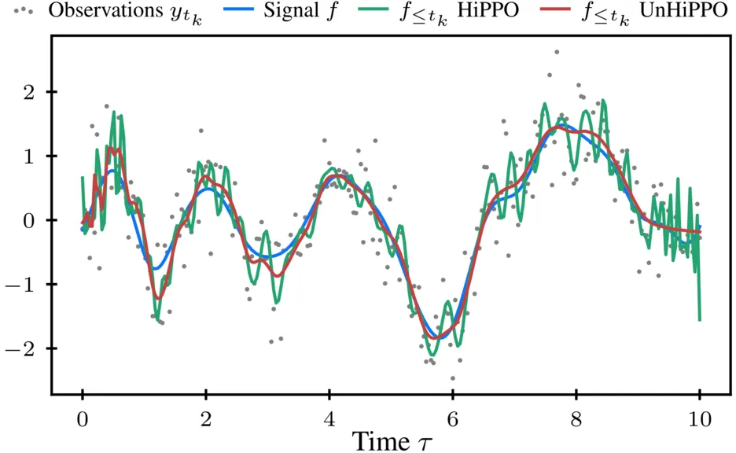

# UnHiPPO: Uncertainty-aware Initialization for State Space Models

Marten Lienen, Abdullah Saydemir, Stephan Günnemann

https://openreview.net/forum?id=U8GUmxnzXn

https://arxiv.org/abs/2506.05065

<p align="center"></p>

This repository contains the code that produced the results in the paper.
Feel free to build upon this or take bits and pieces for your own project with proper attribution, see [Citation](#Citation) below.

## Installation

If you want to run our code, start by setting up the python environment.
We use [pixi](https://pixi.sh/) to easily set up reproducible environments based on conda packages.
Install it with `curl -fsSL https://pixi.sh/install.sh | bash` and then run

```sh
# Clone the repository
git clone https://github.com/martenlienen/unhippo.git

# Change into the repository
cd unhippo

# Install and activate the environment
pixi shell
```

## Training

We use [hydra](https://hydra.cc/) for configuration, so you can overwrite all settings from the command line, e.g. the dataset with `data=fsd` as above.
Check the [`config`](./config) directory to explore the available configuration options.
To train on FSD or SC10, just pass `data=fsd` or `data=sc10` and the script will automatically download the dataset into the `data` directory and preprocess it for you.

Hydra also let's you submit jobs to a slurm cluster easily.
So to recreate, for example, our results on FSD, just run
```sh
./train.py -m hydra/launcher=slurm hydra.launcher.qos=<your-qos> hydra.launcher.partition=<your-gpu-partition> experiment=fsd
```

## Research

We decided to leave some of our work-in-progress notebooks in [`notebooks`](./notebooks).
So if you want to see how this method came about, feel free to snoop around in there.
Please be aware, that some of the notebooks likely won't run anymore and we will also not fix them.
They are meant to be an artifact of the research process.

## Citation

If you build upon this work, please cite our paper as follows.

```bibtex
@inproceedings{lienen2025unhippo,
  title = {{{UnHiPPO}}: {{Uncertainty}}-aware {{Initialization}} for {{State Space Models}}},
  author = {Lienen, Marten and Saydemir, Abdullah and G{\"u}nnemann, Stephan},
  booktitle = {International {{Conference}} on {{Machine Learning}}},
  year = {2025},
}
```
